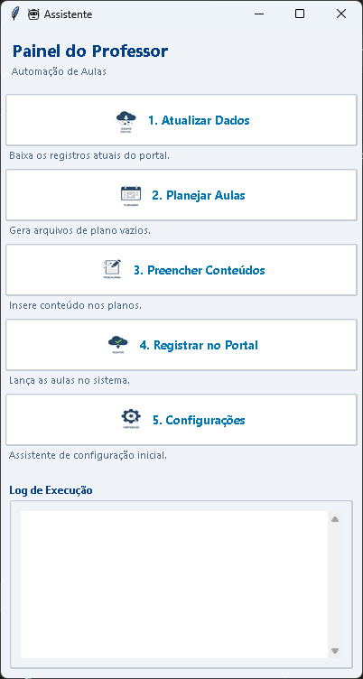
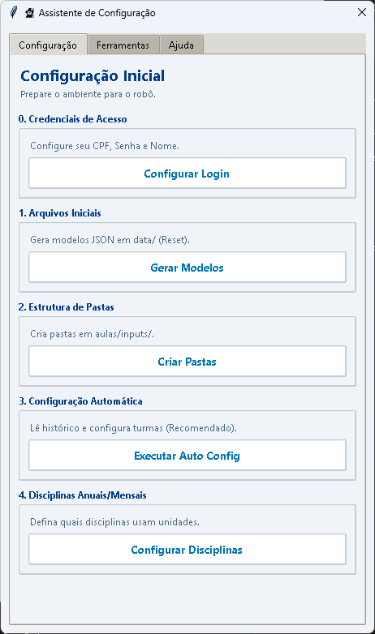

# 🤖 Assistente de Registro de Aulas - Portal Seduc-PI

Bem-vindo ao **Assistente de Aulas**! Este projeto foi desenvolvido para interagir com o **Portal Seduc-PI**, facilitando o registro e o gerenciamento das aulas já ministradas ou planejadas.

⚠️ **Nota sobre o Escopo:** A geração de conteúdo pedagógico **não é o objetivo** desta ferramenta.
*   **O Professor:** Deve colocar o material pronto (resumos, roteiros) na pasta `aulas/inputs`.
*   **Os Scripts:** Processam esses inputs e geram arquivos de texto (`.txt`) padronizados na pasta `aulas/`.
*   **O Robô:** Lê esses arquivos `.txt` e realiza o registro automático no portal.

Agora com uma **Interface Gráfica (GUI)** amigável!

<div align="center">
  
  
</div>

## 🚀 Configuração Inicial (Ambiente)

### 1. Instalação

Certifique-se de ter o Python instalado.

```bash
# Crie um ambiente virtual
python -m venv .venv

# Ative o ambiente
# Windows:
.venv\Scripts\activate
# Linux/Mac:
source .venv/bin/activate

# Instale as dependências
pip install -r requirements.txt
```

### 2. Configurando a pasta `data/`

Para garantir a segurança, as pastas com dados sensíveis são ignoradas pelo Git. Configure-as usando os modelos:

1.  Execute o assistente de configuração:
    ```bash
    python tools/setup_wizard.py
    ```
2.  Escolha a opção **1** para gerar os arquivos modelo.
3.  Edite os arquivos gerados em `data/` com suas informações reais.
4.  Execute novamente e escolha a opção **2** para criar as pastas de input automaticamente.

## 🖥️ Como Usar

O projeto possui um ponto de entrada único que facilita a execução:

### Interface Gráfica (Recomendado)
Basta executar o arquivo `app.py`:
```bash
python app.py
```
Uma janela abrirá com botões para cada etapa do processo (Coleta, Planejamento, Preenchimento, Registro).

### Linha de Comando (CLI)
Se preferir usar o terminal ou estiver em um servidor sem interface gráfica:
```bash
python app.py --cli
```

## 📚 Documentação

*   📖 Tutorial de Uso: Guia passo a passo para o professor.
*   🏗️ Arquitetura Técnica: Para desenvolvedores entenderem a estrutura do código.
*   🤖 Detalhes do Scraper: Como funciona a coleta de dados.
*   🛠️ **Ferramentas Secundárias**: Documentação dos utilitários de análise e gestão de conteúdo (CSV, PDFs, Relatórios).
*   📜 **[Histórico de Mudanças (Changelog)](CHANGELOG.md)**: Detalhes das versões lançadas.